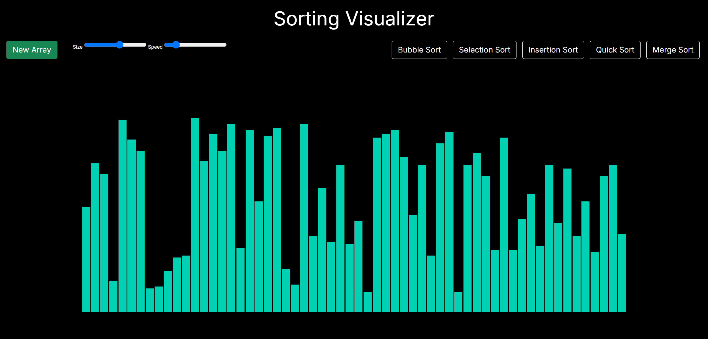
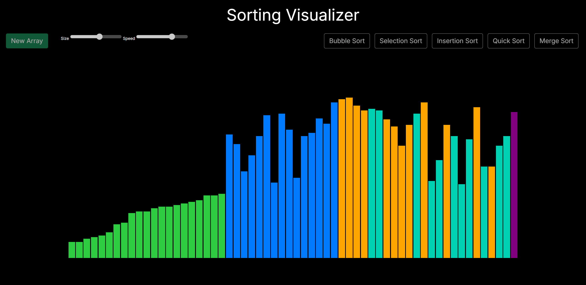
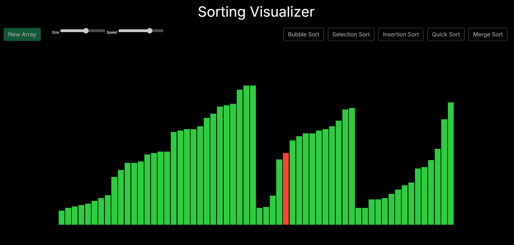
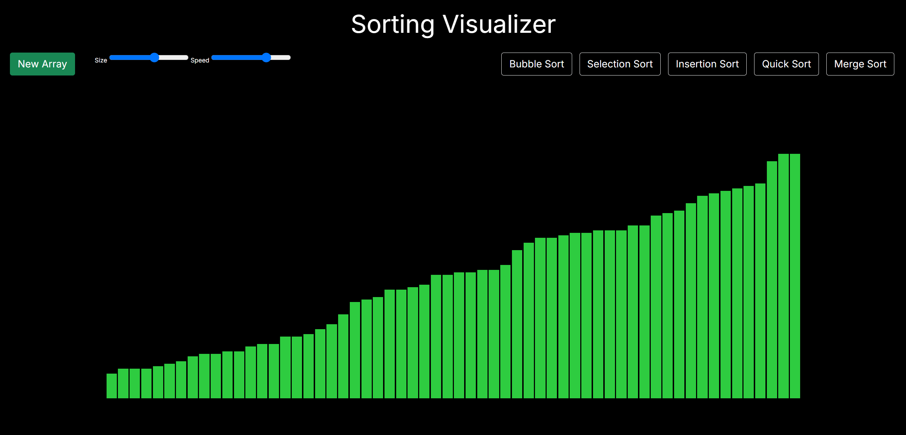
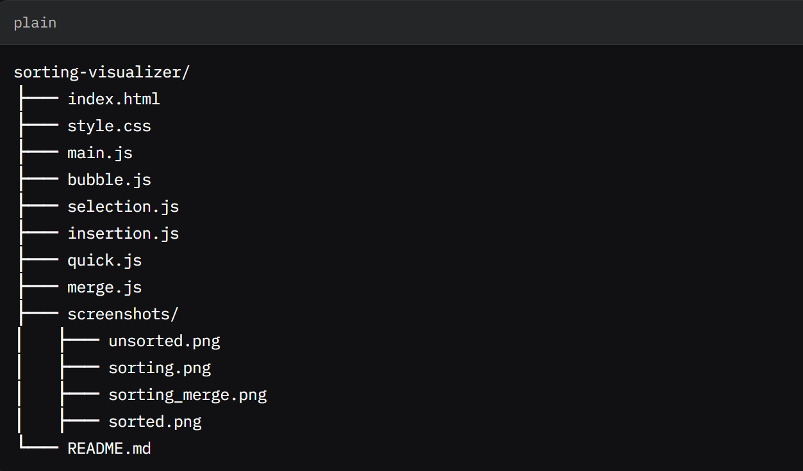

Sorting Visualizer
Overview 📖
The Sorting Visualizer is a web-based application designed to demonstrate the mechanics of various sorting algorithms through interactive, real-time visualizations. Users can generate random arrays of bars and observe how algorithms such as Bubble Sort, Selection Sort, Insertion Sort, Quick Sort, and Merge Sort rearrange them. Built with HTML, CSS (leveraging Bulma for styling), and JavaScript, the visualizer offers intuitive controls for adjusting array size and animation speed, making it an engaging tool for learning sorting algorithms. 🚀
Features ✨

🖱️ Interactive Controls: Adjust array size (number of bars) and sorting speed using sliders for a customized experience.
📊 Multiple Algorithms: Visualize five popular sorting algorithms:
🫧 Bubble Sort
🔍 Selection Sort
➡️ Insertion Sort
⚡ Quick Sort
🔗 Merge Sort

🎨 Dynamic Visualization: Bars represent array elements, with heights corresponding to values. Color changes (e.g., 🔴 for comparisons, 🟢 for sorted elements, 🩵 for reset) highlight key operations.
📱 Responsive Design: Bar widths adapt dynamically to the array size, ensuring optimal display across devices.
🖥️ User-Friendly Interface: Includes buttons to generate new arrays or initiate sorting, with UI elements disabled during sorting to prevent interference.
🎥 Smooth Animations: Fluid transitions and color-coded bars enhance clarity and engagement.

Technologies Used 🛠️

🌐 HTML: Provides the structure for the visualizer, including the bar container and control elements.
🎨 CSS: Utilizes Bulma (via CDN) for a modern, responsive design, with custom styles for bar animations.
💻 JavaScript: Implements array generation, sorting algorithms, and DOM manipulation for real-time updates.

## 📸 Preview

Below are screenshots showcasing the Sorting Visualizer in various states:

![Sorting Visualizer Demo]

Randomly generated array before sorting.
Bars highlighted in red during comparisons.
Merge Sort in action with dynamic bar updates.
Fully sorted array with all bars in green.

Setup Instructions ⚙️

📥 Clone or Download:
Clone the repository: git clone <repository-url>
Alternatively, download the project files as a ZIP and extract them.

📂 File Structure:sorting-visualizer/

🚀 Serve the Application:
Open index.html in a modern web browser (e.g., Chrome, Firefox).
For best results, use a local server to avoid CORS issues with external resources like Bulma:
Python: python -m http.server
VS Code: Use the Live Server extension.

📦 Dependencies:
No local installations required. The project uses Bulma CSS via a CDN for styling.

Usage 🎮

🌐 Open the Visualizer:
Load index.html in a web browser.

📈 Generate an Array:
Use the Size slider to set the number of bars (default: 60).
Click the New Array button to generate a random array. 🔄

🛠️ Sort the Array:
Select an algorithm by clicking its button (e.g., Bubble Sort, Quick Sort).
Adjust the Speed slider to control animation speed (higher value = faster sorting). ⚡

👀 Observe the Animation:
Bars change colors to indicate:
🔴 Comparisons
🟢 Sorted elements
🩵 Reset state
Quick Sort-specific: 🟣 Pivot, 🟠 Current element, 🔵 Smaller elements

The UI is disabled during sorting to prevent interruptions. 🔒

🔁 Repeat:
Generate a new array or select a different algorithm to explore further.

Algorithm Details 📚

🫧 Bubble Sort: Iteratively compares and swaps adjacent elements if out of order.Time Complexity: O(n²)
🔍 Selection Sort: Repeatedly selects the smallest element from the unsorted portion and places it at the beginning.Time Complexity: O(n²)
➡️ Insertion Sort: Builds a sorted portion by inserting each element into its correct position.Time Complexity: O(n²)
⚡ Quick Sort: Partitions the array around a pivot and recursively sorts sub-arrays.Average Time Complexity: O(n log n)
🔗 Merge Sort: Divides the array into halves, recursively sorts, and merges them.Time Complexity: O(n log n)

Contributing 🤝
Contributions are welcome! To contribute:

Fork the repository.

Create a feature branch (git checkout -b feature-name).
Commit your changes (git commit -m 'Add feature').
Push to the branch (git push origin feature-name).
Open a pull request.
